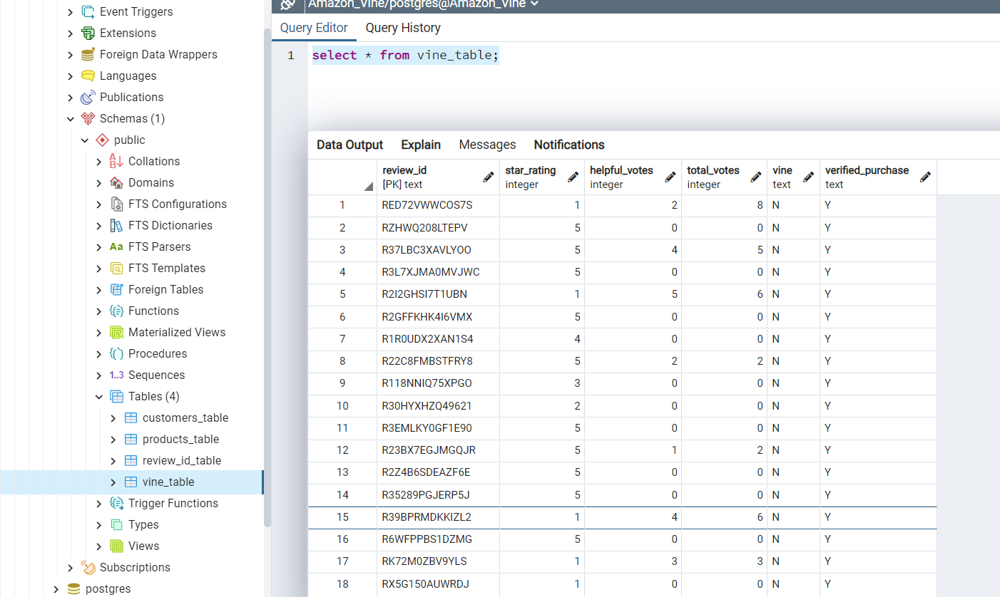

# Amazon Vine Review analysis

## Overview of analysis

The purpose of this project is to determine whether paid Vine reviews influence the overall reviews of products. This was completed using Google Colab and pyspark. The data was based on reviews of lawn and garden products on Amazon.

### Resources

* Data Sources: https://s3.amazonaws.com/amazon-reviews-pds/tsv/amazon_reviews_us_Lawn_and_Garden_v1_00.tsv.gz

* Software: Google Colab, pyspark, pgAdmin, AWS RDS and S3

## Tables 

Customers table

Products table

Review ID table

Vine table

## Results

Vine and Non Vine Reviews

Five Star Reviews

## Summary

The products with Vine reviews did not have a higher percentage of 5 star reviews.  
The percentage of 5 star reviews for non-Vine reviewed products is higher.

